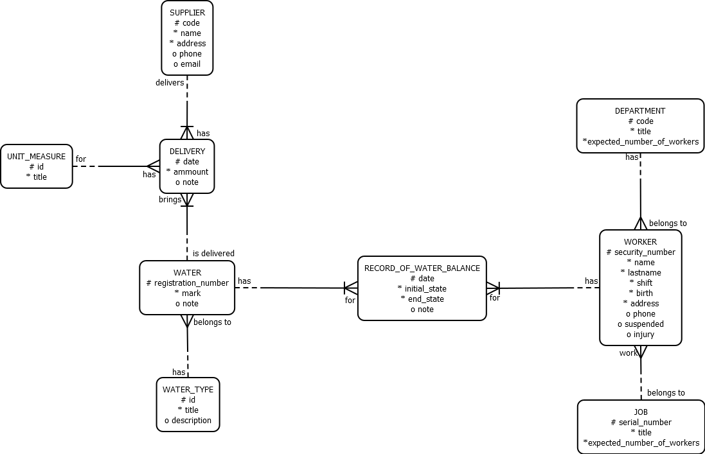
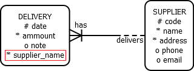
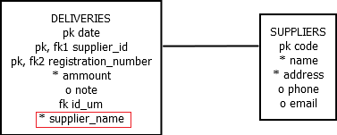
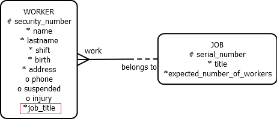
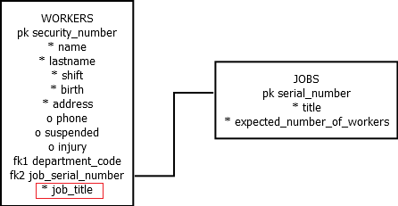
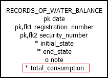
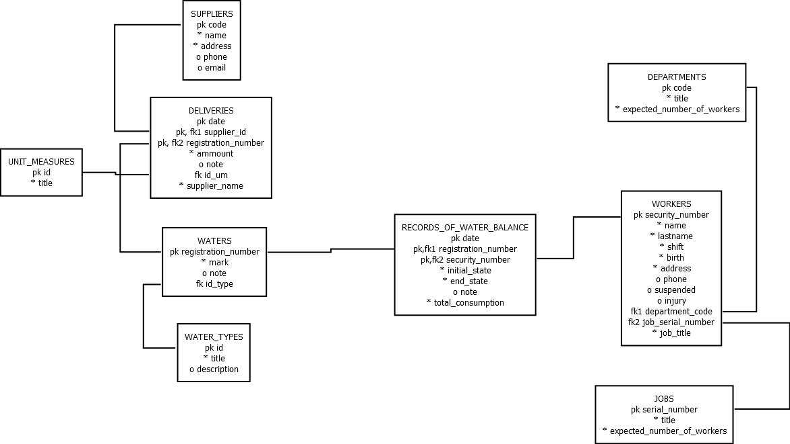

<h1> Oracle Database Project  </h1>

<h1 align = "center">Database for monitoring the basic operations of Heating Plant</h1>

<h2>Contents:</h2>

- [Introduction](#introduction)
- [Entity Relationship diagram](#entity-relationship-diagram)
- [Denormalization](#denormalization)
  - [First Denormalization](#first-denormalization)
  - [Second Demormalization](#second-demormalization)
- [Optimization](#optimization)
- [Index](#index)
- [Procedure](#procedure)
- [Function](#function)
- [Relation schema](#relation-schema)

## Introduction

Project includes basic processes of heating plant from real world.

Main idea of this project is <i>water consumption monitoring</i> and <i>the process of acquiring the necessary water</i> used in production.

The main aspects that make up this information system are:

- The process of acquiring the necessary water,
- Monitoring the consumption of different types of water used during the production,
- Keeping records of the departments in which the workers are located and their main jobs.

## Entity Relationship diagram

Before creating a database, it's necessary to create an er diagram.

Normalization is one of the most important parts that needs to be done correctly in oreder to eliminate anomalies, and to be able to continue with the database design. In order for the diagram to be normalized, all normalization rules must be followed (to create such a model that will not disturb any of the normal forms).

<i>Note: It was used ORACLE notation to create model.</i>

## Denormalization

Denormalization improves database peformance. With intentional duplication of columns in multiple tables <i>(adding redundant data)</i> in order to improve query performance, while disrupting normal forms. Through the application code <i>(using triggers)</i> it's necessary to maintain the integrity of the data and remove the negative subsequent of denormalizations.

### First Denormalization

<b>Pre - Joining Denormalization Technique</b> was performed between "SUPPLIERS" and "DELIVERIES" tables, where the mandatory attribute "name" from "SUPPLIERS" table is transferred in "DELIVERIES" table via primary key, which violates 2NF.

The goal of this denormalization is the need to display the name of supplier who made the delivery.

 

TABLE               |TRIGGER TYPE          |COLUMN       |NEEDED                   |WHAT TO DO                            |NUMBER|
--------------------|----------------------|-------------|-------------------------|--------------------------------------|------|
SUPPLIERS           |                INSERT|            /|                       NO|                                     /|     /|
SUPPLIERS           |                UPDATE|supplier_name|                      YES|When changing the value of the supplier_name column in the SUPPLIERS table, it's necessary to start a trigger that will update the changed value in the DELIVERIES table|     1|
SUPPLIERS           |                DELETE|            /|                       NO|                                     /|     /|
DELIVERIES          |                INSERT|             |                      YES|The Trigger updates the value of the supplier_name column based on the value of supplier_code column|     2|
DELIVERIES          |                UPDATE|supplier_code|                      YES|If the supplier_code column is changed, the supplier_name column must also be changed|     2|
DELIVERIES          |                UPDATE|supplier_name|                      YES|Direct update of supplier_name column is forbidden|     3|
DELIVERIES          |                DELETE|            /|                       NO|                                     /|     /|

### Second Demormalization

<b>Pre - Joining</b> 3NF denormalization was performed between "JOBS" and "WORKERS" tables by transfering the mandatory attribute job_title from "JOBS" table to the "WORKERS" table via a foreign key job_serial_number. 

Denormalization was performed in order to reduce the merging of tables and to immediately know the job title of an worker.

 

TABLE               |TRIGGER TYPE          |COLUMN           |NEEDED                   |WHAT TO DO                            |NUMBER|
--------------------|----------------------|-----------------|-------------------------|--------------------------------------|------|
JOBS                |                INSERT|                /|                       NO|                                     /|     /|
JOBS                |                UPDATE|        job_title|                      YES|When changing the job_title column, it was necessary to start a trigger that will update the changed value in the WORKERS table|     1|
JOBS                |                DELETE|                /|                       NO|                                     /|     /|
WORKERS             |                INSERT|                 |                      YES|The trigger will update the job_title column value based on the inserted/entered job_number column value|     2|
WORKERS             |                UPDATE|job_serial_number|                      YES|The trigger updates the value of the job_title column based on the value of the job_serial_number column|     2|
WORKERS             |                UPDATE|         job_title|                      YES|The trigger won't allow direct modification of the job_title column|     3|
WORKERS             |                DELETE|                /|                       NO|                                     /|     /|

## Optimization

In order to increase the response speed of the database when query is made, it's necessary to perform an optimization that will improve the performance of the database itself.

Based on the constant need for monitoring of the total consumption of water that occured in a certain period during production, the <b>Storing Derivable Values optimization technique</b> was performed.

The database optimization was done over the "RECORDS_OF_WATER_BALANCE" table. A new attribute total_consumption has been added, which represents the difference between the attributes end_state and initial_state. The total_consumption column contains data on how much total water was consumed on given date.

<b>total_consumption = end_state - initial_state</b>.

TABLE                   |TRIGGER TYPE          |COLUMN                      |NEEDED                   |WHAT TO DO                            |NUMBER|
------------------------|----------------------|----------------------------|-------------------------|--------------------------------------|------|
RECORDS_OF_WATER_BALANCE|                INSERT|                            |                      YES|The trigger will update the value of the total_consumption column based on the values entered for the end_state and start_state columns|     1|
RECORDS_OF_WATER_BALANCE|                UPDATE|      start_state, end_state|                      YES|The trigger will update the value of the total_consumption column based on the changed values of the end_state and start_state columns|     1|
RECORDS_OF_WATER_BALANCE|                UPDATE|           total_consumption|                      YES|The trigger won't allow updating the column directly|     1|
RECORDS_OF_WATER_BALANCE|                DELETE|                           /|                       NO|                                     /|     /|

## Index

For faster and more efficient access to database rows, a certain data structure is used, i.e. indexes. Scanning the entire table to find a particular value can be bypassed by implementing an index.

Created indexes are on tables:
- WORKERS,
- SUPPLIERS,
- WATERS.

## Procedure

The goal of the <i>add_supplier</i> procedure is to ease the inserting data for the user, as well as to check whether the inserted supplier currently exists. The input parameters are supplier's code, supplier's name and supplier's address, wihch are used to enter data into the SUPPLIERS table.

When inserting a suppliers into the database, it's checked whether such a supplier currently exists. If a supplier with the same code already exists, a corresponding message will be printed. Otherwise, if the supplier being inserted does not exist, the supplier will be added to the database notifying the user that a new supplier has been added.

## Function

The function <i>number_deliveries</i> which is created, counts how many deliveries were made for a given date. The delivery date is passed as a function parameter, and a text message with an integer value as the return result. If there are no deliveries for the forwarded date, a message that there are no such deliveries will be displayed. If there is, the recalculated number of deliveries is returned as a return value together with a corresponding message of the total number of those deliveries.

## Relation schema

